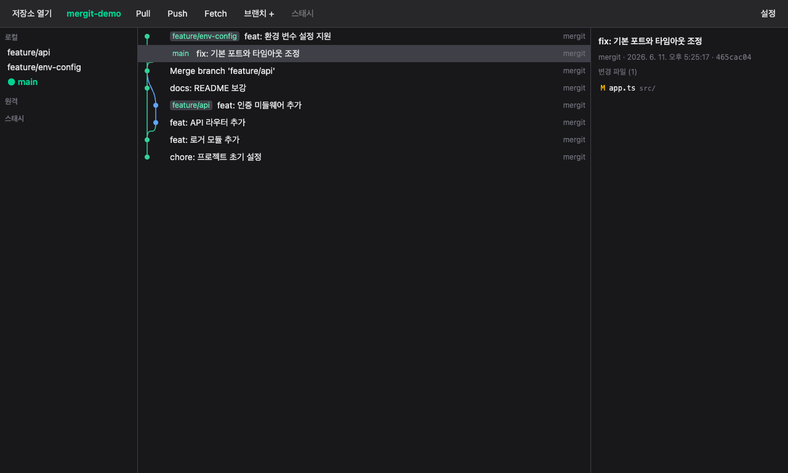
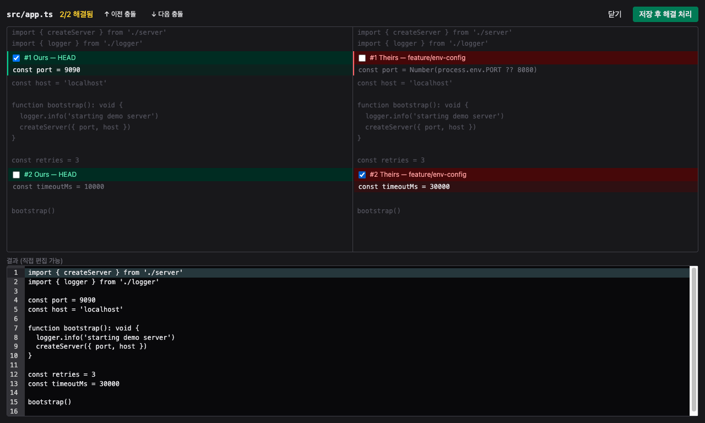

# Mergit

**Mergit** (merge + git) — staging, history, conflict 해결에 집중한 minimal 데스크톱 Git 클라이언트.

Mergit is a minimal desktop Git client for staging, history, and conflict resolution without fighting Git.

Mergit은 스테이징, 히스토리 확인, 충돌 해결을 빠르고 안전하게 끝내는 minimal 데스크톱 Git 클라이언트입니다.

> ⚠️ 초기 버전입니다. 피드백과 이슈 제보를 환영합니다.

<p>
  <a href="https://github.com/gloz9102/mergit/releases/latest"><strong>Download for Windows</strong></a>
  ·
  <a href="#소스에서-실행"><strong>Run from source</strong></a>
  ·
  <a href="#의도적으로-하지-않는-것"><strong>Scope</strong></a>
</p>

## 왜 Mergit인가

- **Conflict-first** — merge, cherry-pick, revert 중 생긴 충돌을 한 흐름에서 해결합니다.
- **Safe daily Git** — stage, commit, amend, undo last commit, stash, push/pull/fetch 같은 매일 쓰는 작업을 작게 제공합니다.
- **Git-native** — 별도 계정이나 호스팅 서비스 연동 없이 시스템 git, credential helper, SSH 설정을 그대로 사용합니다.
- **한국어/영어 지원** — 시스템 로케일 자동 감지와 설정 전환을 지원합니다.



3-패널 conflict 해결 에디터:



## 한눈에 보기

| 포함 | 상태 |
|---|---|
| 커밋 그래프 / 브랜치 레인 / WIP 행 | 지원 |
| 커밋 검색 / 브랜치 검색·필터 | 지원 |
| 파일 단위 stage / unstage / discard | 지원 |
| commit / amend / undo last commit | 지원 |
| branch 생성·전환·rename·delete·merge | 지원 |
| push / pull / fetch | 지원 |
| stash save / apply / pop / drop / 파일 단위 stash | 지원 |
| merge / cherry-pick / revert conflict 해결 | 지원 |
| 한국어 / 영어 | 지원 |
| hunk·line 단위 staging | 예정 |
| 3-way base conflict editor | 예정 |

## 주요 기능

- **커밋 그래프** — 브랜치 레인 시각화, 가상 스크롤, topo/date order 전환, all/current history 전환. 작업 중인 변경(WIP)이 그래프 최상단에 표시됩니다.
- **검색과 탐색** — 커밋 메시지/작성자 검색, 브랜치 fuzzy 검색·필터, 최근 저장소와 북마크를 지원합니다.
- **3-패널 conflict 해결** — 충돌 시 Ours/Theirs를 나란히 놓고 블록별 체크박스로 선택, 하단 Output 에디터에서 결과를 직접 수정. 해결 진행 카운터와 충돌 블록 간 이동을 지원합니다.
- **Staging** — 파일 단위 stage / unstage / discard, diff는 중앙 패널에서 크게 확인.
- **커밋 작업** — commit, amend, 마지막 커밋 취소(soft reset), cherry-pick, revert를 제공합니다.
- **브랜치 관리** — 생성 · 전환 · 이름 변경 · 삭제(미머지 시 강제 삭제 확인), 우클릭 컨텍스트 메뉴.
- **원격 작업** — Push / Pull / Fetch (시스템 git의 credential helper / SSH 설정을 그대로 사용), ahead/behind 표시, 진행 중 스피너 표시.
- **Stash** — 저장 / 적용 / pop / 삭제, 파일 단위 stash.
- **한국어/영어** — 시스템 로케일 자동 감지, 설정에서 즉시 전환.
- **외부 변경 자동 감지** — 터미널에서 git을 사용해도 화면이 자동 갱신됩니다.

## 다운로드 (Windows)

[Releases](https://github.com/gloz9102/mergit/releases)에서 받을 수 있습니다.

| 파일 | 설명 |
|---|---|
| `Mergit-Setup-x.x.x.exe` | 원클릭 설치 버전 |
| `Mergit-Portable-x.x.x.exe` | 설치 없이 바로 실행 |

**실행 전 확인:**
- PC에 **git이 설치되어 있어야 합니다** (`git --version`으로 확인).
- 코드 서명이 없는 빌드라 SmartScreen 경고가 뜰 수 있습니다 — **"추가 정보" → "실행"** 으로 진행하세요.

macOS / Linux는 아직 패키지를 제공하지 않습니다. 아래 "소스에서 실행"으로 사용할 수 있습니다.

## 소스에서 실행

요구 사항: Node.js 20+, git

```bash
git clone https://github.com/gloz9102/mergit.git
cd mergit
npm install
npm run dev        # Electron 개발 모드 (HMR)
```

| 스크립트 | 설명 |
|---|---|
| `npm run dev` | 개발 모드 실행 |
| `npm test` | Vitest 단위/통합 테스트 |
| `npm run typecheck` | TypeScript 검사 |
| `npm run build` | 프로덕션 번들 (out/) |
| `npm run dist:win` | Windows 설치 파일 빌드 (release/) |
| `npm run dist:mac` | macOS DMG 빌드 (release/) |

## 의도적으로 하지 않는 것

Mergit은 모든 Git 기능을 담는 도구가 아닙니다. 자주 쓰는 핵심 흐름을 작고 안전하게 제공하는 것을 목표로 합니다.

- GitHub/GitLab PR·이슈·계정 연동
- GitFlow 전용 UI
- submodule 관리 UI
- tag CRUD
- GPG signing 설정 UI
- interactive rebase 전체 UI
- AI commit message 생성
- 자체 credential manager

## 아키텍처

```
┌─────────────────────────────── Electron ───────────────────────────────┐
│  Main 프로세스                      Renderer (React + Tailwind)         │
│  ┌──────────────┐   타입드 IPC     ┌──────────────────────────────┐    │
│  │ GitService   │◄────(봉투 응답)──►│ zustand 스토어 → 컴포넌트      │    │
│  │ (simple-git) │                  │ GraphView / Staging /         │    │
│  │ RepoWatcher  │──repo-changed──► │ ConflictEditor / i18n(ko,en)  │    │
│  └──────────────┘                  └──────────────────────────────┘    │
│            └── 순수 로직은 src/shared/ (로그 파서 · 레인 배치 · conflict 파서) │
└─────────────────────────────────────────────────────────────────────────┘
```

- **git 작업은 전부 main 프로세스**의 `GitService`(simple-git 래퍼)가 수행하고, renderer는 contextBridge로 노출된 `window.api`만 사용합니다 (`nodeIntegration: false`, `contextIsolation: true`).
- IPC 응답은 `{ ok, data } | { ok: false, error }` 봉투로 통일 — 에러는 코드화되어 i18n된 토스트로 표시됩니다.
- 그래프 레인 배치, git log 파싱, conflict 마커 파싱은 `src/shared/`의 순수 함수로 분리되어 단위 테스트됩니다.

```
src/
  main/        # Electron main — GitService, IPC, RepoWatcher
  preload/     # contextBridge 브리지
  renderer/    # React UI — 컴포넌트, 스토어, i18n
  shared/      # main/renderer 공유 순수 로직 + 타입
```

## 테스트

```bash
npm test
```

- 순수 로직 단위 테스트: 로그 파서, 레인 배치 알고리즘, conflict 파서/빌더
- `GitService` 통합 테스트: 임시 디렉토리에 실제 git 저장소를 만들어 충돌 머지 → 해결 → 머지 커밋까지 재현

## 알려진 한계

- hunk/line 단위 staging은 아직 지원하지 않습니다.
- 3-way conflict editor에서 base 패널과 자동 비충돌 적용은 아직 지원하지 않습니다.
- rebase(인터랙티브 포함), tag 관리, GPG 서명은 지원하지 않습니다.
- 한 창에서는 저장소 하나만 엽니다. 여러 저장소는 새 창으로 열 수 있습니다.
- GitHub/GitLab 연동(PR, 이슈)은 없습니다.
- 그래프 레인 배치는 첫-부모-우선 휴리스틱이라 복잡한 머지 히스토리에서 레인이 교차할 수 있습니다.

## 라이선스

[MIT](LICENSE)
